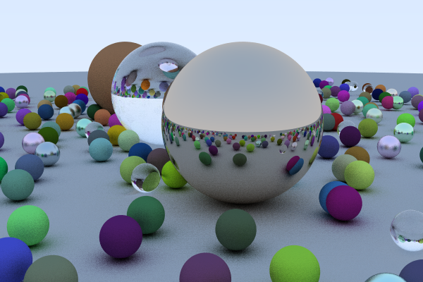

cuda-tools-examples/ray-tracing
===

## Example image (with default options)



## Setup

1. Install nightly compiler.
For example, 
```
$ rustup default nightly
```

2. Install nvptx64-nvidia-cuda target.
```
$ rustup target add nvptx64-nvidia-cuda
```

3. Set `CUDA_PATH` environment  variable (if needed).
    e.g. "/opt/cuda"

## Run
Default(seed=0, h=400, w=600, ray-per-pixel=128)
```
$ cargo run --release
```

Run with options(seed=1, h=1080, w=1920, ray-per-pixel=256)
```
$ cargo run --release -- -s 1 -h 1080 -w 1920 -r 256
```
